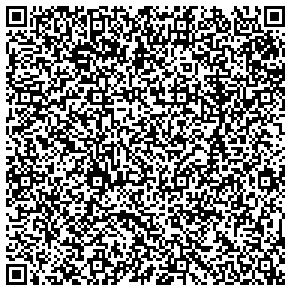

# Norsk Koronasertifikat og Europeisk *Digital Green Certificate*

Er du nysgjerrig på hvordan [koronasertifikatet](https://www.fhi.no/om/koronasertifikat/) virker? Hvis du allerede [har fått et selv](https://www.helsenorge.no/koronasertifikat/), så har du kanskje scannet QR-koden for å se om du kan tolke dataene – og funnet en helt uleselig tekst (f.eks. `NO1:6BFMI1.V54KP2 A/9522QP008ZD+0…`). Hvordan er informasjonen lagret? Hvordan er det mulig å sjekke at sertifikatet er ekte? Hvorfor tar det ekstra tid før det kan brukes i resten av Europa – og betyr dette at andre land får tilgang til det norske vaksineregisteret? Alt det kan du finne svar på (blant annet) på [Folkehelseinstitutet sin webside](https://www.fhi.no/om/koronasertifikat/) – men hvis du er *ekstra* nysgjerrig og også vil prøve å lage din egen vaksinepass-sjekker/dekoder, så er du allerede på rett sted.

**VIKTIG!!!** *Koronasertifikatet inneholder sensitive personlige opplysninger, så du må _aldri_ poste QR-koden eller dekodede data på nettet, eller laste det opp til tjenester på nettet (inkludert TurtleDuck / puffling.no). Helseinformasjon og personlige opplysninger kan gjerne misbrukes på ufortsigbare måter, så det er best å være forsiktig, selv om du ikke tenker på informasjonen som «hemmelig». Det norske sertifikatet inneholder (deler av) navnet ditt, fødselsdato og detaljer om COVID19-vaksinering, testing og evt. immunitet. Europeisk sertifikat vil ha full navn i tillegg. Les mer om hva sertifikatet inneholder i [FHIs personvernerklæring](https://www.fhi.no/om/koronasertifikat/personvern/).*



## Standardisering av vaksinepasset

Koronasertifikatet er fremdeles under aktiv utvikling, og utviklingen skjer i offentlighet – så du kan både følge med og delta om du vil:

* GitHub: [EU Digital Green Certificates](https://github.com/eu-digital-green-certificates) – her finner du dokumentasjon og beskrivelse av prosesser, masse testdata, og referanseimplementasjon for de forskjellige delene av infrastrukturen. Du kan til og med se [hva du må gjøre hvis du er et EU/EØS-land og vil koble deg på fellesløsningen](https://github.com/eu-digital-green-certificates/dgc-participating-countries).

* GitHub: [European eHealth network - digital covid certificate coordination](https://github.com/ehn-dcc-development) – her skjer det aktiv utvikling, du kan f.eks. [lese spesifikasjonen til koronasertifikatet]() og se hva som [kan gå galt når man scanner QR-koden med telefon](https://github.com/ehn-dcc-development/hcert-spec/issues/64)

* EU har også [offisielle dokumenter om COVID-19 e-helse](https://ec.europa.eu/health/ehealth/covid-19_en)

* Folkehelseinstituttet har oversikt over [arbeidet med norske koronasertifikatet](https://www.fhi.no/om/koronasertifikat/arbeidet-med-koronasertifikat/). Norge følger samme standard som EU, med mindre forskjeller for det nasjonale koronasertifikatet som er tilgjengelig nå (juni 2021).

## Datastruktur

Koronasertifikatet inneholder en nøkkel/verdi-datastruktur med navn, fødselsdato, gyldighetsinfo, og info om vaksine/testing/immunitet. Dataene er så [signert digitalt](https://en.wikipedia.org/wiki/Digital_signature) ved hjelp av en offentlig-nøkkel krypteringalgoritme ([ECDSA](https://en.wikipedia.org/wiki/Elliptic_Curve_Digital_Signature_Algorithm)). Signaturen gjør at man kan sjekke at sertifikatet er gyldig og utstedt av landets myndigheter.

Selve datastrukturen («payload») ser slik ut (i [JSON-format](https://en.wikipedia.org/wiki/JSON)):

```json
{
	"iss": "NO",                 // issuer; landkode for utsteder
	"exp": 1631311200,           // expiration time; utløpsdato (2021-09-11)
	"iat": 1623597458,           // issued at; utstedelsesdato (2021-06-13)
	"hcert": {                   // helsesertifikat
		"eu_dcc_v1": {           // EU Digital Covid Certificate v1
			"du": "2021-09-11",  // valid until; utløpsdato
			"dob": "1977",       // date-of-birth; fødselsdato eller år
			"nam": {             // name; navn
				"fn": "BAG*",    // family name; etternavn i UTF-8-format
				"gn": "A.",      // given name; fornavn (given name)  i UTF-8-format
				"fnt": "BAG",    // etternavn i pass-format
				"gnt": null      // fornavn i pass-format
			},
			"ver": "1.0.0",      // standard-versjon
			"reason": 0          // ???
		}
	}
}
```

Eksempelet over er fra den norske kontrollsiden for innenlands bruk og inneholder ingen konkrete opplysninger om vaksinering – dette er siden som vil være grønn eller rød avhengig av om du er vaksinert eller ikke (den blir grønn om du er vaksinert med minst én dose for minst tre uker siden). Bevis på vaksinering finner man på den *utvidede kontrollsiden*, med en QR-kode som inneholder et EU-standard sertifikat. Vaksineinformasjonen er lagret som et ekstra felt i sertifikatet (`v` for vaksine; evt. `t` for testresultat eller `r` (recovery) for gjennomgått sykdom): 

```json
{"v": [{
		"ci": "URN:UVCI:01:NO:VAK/KR2XE5DMMVCHKY3LB",  // unik ID fra vaksinasjonsregisteret	                          
		"co": "NO",                                    // land/organisasjon som har satt vaksinen
		"dn": 1,                                       // dosenummer
		"dt": "2021-04-31",                            // vaksinasjonsdato
		"is": "Norwegian Institute of Public Health",  // sertifikat-utsteder => FHI
		"ma": "ORG-100030215",                         // markedsfører => Biontech Manufacturing GmbH
		"mp": "EU/1/20/1528",                          // medisinsk produkt => Comirnaty (BioNTech/Pfizer)
		"sd": 2,                                       // antall doser for full vaksinering
		"tg": "840539006",                             // target => COVID-19
		"vp": "1119349007"                             // vaksinetype => SARS-CoV-2 mRNA vaccine
	}, {
		"ci": "URN:UVCI:01:NO:VAK/IR2WG22UOVZHI3DFB",
		"co": "NO",
		"dn": 2,
		"dt": "2021-06-31",
		"is": "Norwegian Institute of Public Health",
		"ma": "ORG-100030215",
		"mp": "EU/1/20/1528",
		"sd": 2,
		"tg": "840539006",                             // http://snomed.info/id/840539006
		"vp": "1119349007"                             // http://snomed.info/id/1119349007
	}]}
```

([Standarden](https://ec.europa.eu/health/sites/default/files/ehealth/docs/covid-certificate_json_specification_en.pdf) spesifiserer at sertifikatet kun skal inneholde informasjon om én vaksinedose (f.eks. dose 2 av 2); den norske kontrollsiden har likevel (juni 2021) info om begge dosene hvis man er fullvaksinert.)

Tallkodene for virussykdommen ([840539006](http://snomed.info/id/840539006), [COVID-19](https://en.wikipedia.org/wiki/COVID-19)), viruset ([840533007](http://snomed.info/id/840533007), [SARS-CoV-2](https://en.wikipedia.org/wiki/Severe_acute_respiratory_syndrome_coronavirus_2)) og vaksinene ([1119349007](http://snomed.info/id/1119349007), [mRNA-basert vaksine](https://en.wikipedia.org/wiki/RNA_vaccine)) er basert på [SNOMED CT](https://confluence.ihtsdotools.org/display/DOCCV19). De mulige verdiene er beskrevet i [et sett med JSON-datafiler](https://github.com/ehn-dcc-development/ehn-dcc-schema/tree/release/1.3.0/valuesets) – f.eks., for Pfizer-vaksinen:

```json
 "EU/1/20/1528": {
      "display": "Comirnaty",
      "lang": "en",
      "active": true,
      "system": "https://ec.europa.eu/health/documents/community-register/html/",
      "version": ""
    },
```


 Det vil si at sertifikatet ikke er spesifikt for COVID-19 (selv om 840539006 / COVID-19 er eneste gyldige sykdom foreløpig) – samme type sertifikat vil kunne brukes på andre sykdommer/vaksiner (med andre koder) i fremtiden.


Vaksinesjekk kan gjøres ved å:

1. Skanne QR-koden og pakke ut informasjonen
2. Sjekke den digitale signaturen
3. Sjekke at navn/initialer og fødselsdato stemmer
4. Sjekke detaljer – for «forenklet» norsk innenlandspass er det ingen ekstra detaljer, signert sertifikat betyr at personen er «grønn». Med fullt sertifikat kan man f.eks. sjekke at personen er vaksinert:
    * at alle dosene er satt; `v.dn == v.sd`
    * at det har gått nok tid siden vaksineringen (f.eks. `v.dt < today() - timedelta(30)`)
    * at `v.td == 840539006` (COVID-19), `v.vp` er en vaksinetype man er trygg på, osv

Et [eget prosjekt](https://github.com/ehn-dcc-development/dgc-business-rules) lager en standard for å kode regler for godkjenning av vaksinepass (f.eks. «trenger full vaksinering eller gjennomgått sykdom (for mindre 6 måneder siden)»), slik at en vaksineapp vil kunne sjekke om man tilfredstiller reglene for innreise til forskjellige land.

## Digital signatur

Koronasertifikatet er signert ved hjelp av [asymmetrisk kryptering / offentlig nøkkelkryptering](https://en.wikipedia.org/wiki/Public-key_cryptography). Utsteder lager seg to nøkler – en privat nøkkel som må holdes hemmelig, og tilhørende offentlig nøkkel som er tilgjengelig for de som skal sjekke koronasertifikatet. Nøklene er *veldig* store tall, som har egenskapen at den offentlige nøkkelen kan brukes til å dekryptere meldinger som er kryptert med den private nøkkelen (derav asymmetrisk kryptering – forskjellig nøkkel til kryptering og dekryptering). Signaturen inneholder en kontrollsum som er kryptert med den private nøkkelen – ved å dekryptere med den offentlige nøkkelen og sjekke at kontrollsummen stemmer med dataene vet man at signeringen må være gjort av noen som har den private nøkkelen (f.eks. Folkehelseinstituttet for norske koronasertifikater).

Hvordan vet man at den offentlige nøkkelen er ekte? Dvs., at ikke noen har laget sitt egne privat/offentlig nøkkelpar, signert et falskt koronasertifikat og så prøver å lure deg til å tro at deres offentlige nøkkel er FHI sin (eller er utstedt av «Sokovia Ministry of Health and Genetic Enhancement»)?